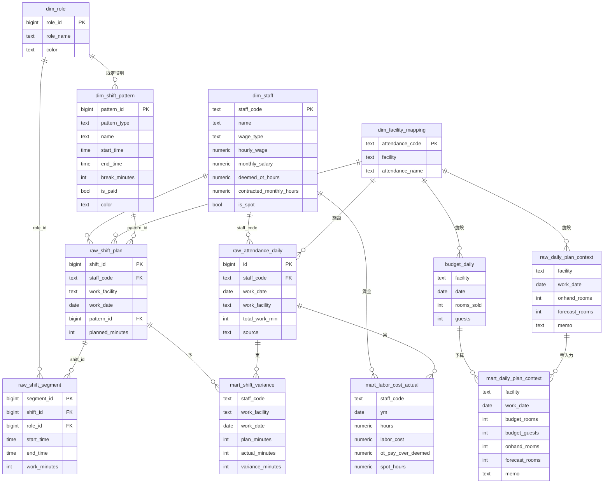

# ER図（シフト・労務管理 v1）

> ⚠️ 更新（as-built）: 実装で一部変更あり。DB全体の正は [`データベース全体設計.md`](データベース全体設計.md)。
> - **人件費モデルv2で個人給与は撤去済み**（2026-07）。`dim_staff_wage` / `mart_labor_cost_actual` / `mart_labor_cost_plan` は**存在しない**。下図でそれらを賃金結線している箇所は無効。
>   現行は `dim_labor_rate`（宿の標準時給）＋ `raw_regular_labor_monthly`（正社員 宿×月lump）で、`dim_staff` は個人給与を持たない（is_spot / employment_type 等のみ）。
> - `budget_daily` の日付列は **`date`**（下図の work_date は誤り。ビュー側で date→work_date 別名）。

凡例: 既存＝再利用（`dim_staff`/`raw_attendance_daily`/`dim_facility_mapping`/`budget_daily`）、新規＝シフト系テーブル、`mart_*`＝集計ビュー。
施設キーは `work_facility`/`facility`（BIコード）、従業員キーは `staff_code`（KOTコード）。時間は分(整数)。

